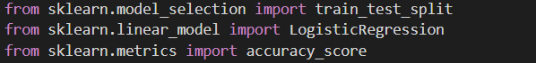
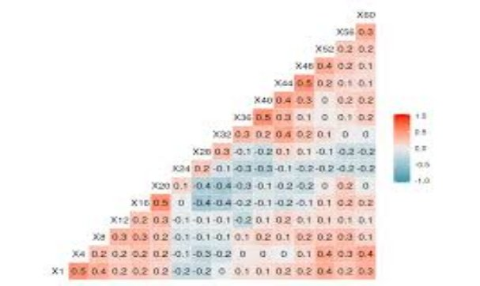
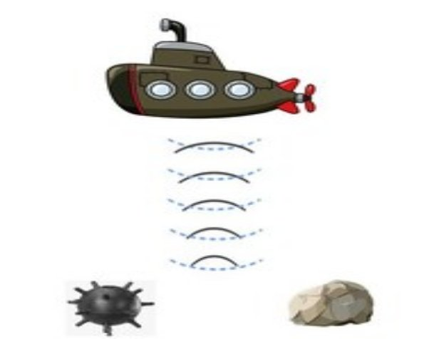

# SONAR-ROCK-VS-MINE-PREDICTION
Sonar\_Rock\_V/S\_Mine\_Prediction

-----
The aim of this project is to predict whether there is a Rock or a Mine underwater using a dataset from kaggle and Machine Learning.

Libraries used:-

-----
- **Numpy**

**Importing Numpy Library**

**About Numpy**

Numpy is a library for the Python programming language, adding support for large, multi-dimensional arrays and matrices, along with a large collection of high-level mathematical functions to operate on these arrays.

- **Pandas**

**Importing Pandas Library**

**About Pandas**

Pandas is a Python package providing fast, flexible, and expressive data structures designed to make working with “relational” or “labeled” data both easy and intuitive. It aims to be the fundamental high-level building block for doing practical, real-world data analysis in Python.

- **Sklearn**

**Importing Sklearn**

**About Sklearn**

Scikit-learn (Sklearn) is the most useful and robust library for machine learning in Python. It provides a selection of efficient tools for machine learning and statistical modeling including classification, regression, clustering and dimensionality reduction via a consistent interface in Python. This library, which is largely written in Python, is built upon NumPy, SciPy and Matplotlib.

**Different functions imported from Sklearn:-**

- **train\_test\_split-** Using [train_test_split()](https://scikit-learn.org/stable/modules/generated/sklearn.model_selection.train_test_split.html) from the data science library [scikit-learn](https://scikit-learn.org/stable/index.html), you can split your dataset into subsets that minimize the potential for bias in your evaluation and validation process.
- **accuracy\_score-** This function computes subset accuracy: the set of labels predicted for a sample must exactly match the corresponding set of labels in y\_true.

Algorithm used:-

-----
- **Logistic Regression**

**Importing Logistic Regression Classifier**

**About**

Logistic Regression is an easily interpretable classification technique that

gives the probability of an event occurring, not just the predicted

classification. It also provides a measure of the significance of the effect of

each individual input variable, together with a measure of certainty of the

variable's effect.

Data Analysis

-----

Model Analysis

-----
- With an accuracy score of 83.42% on training data and an accuracy of 76.19% on test data, our model will predict whether the underwater obstacle is a Mine or a Rock.

Deep Down, Safety Comes First

-----

